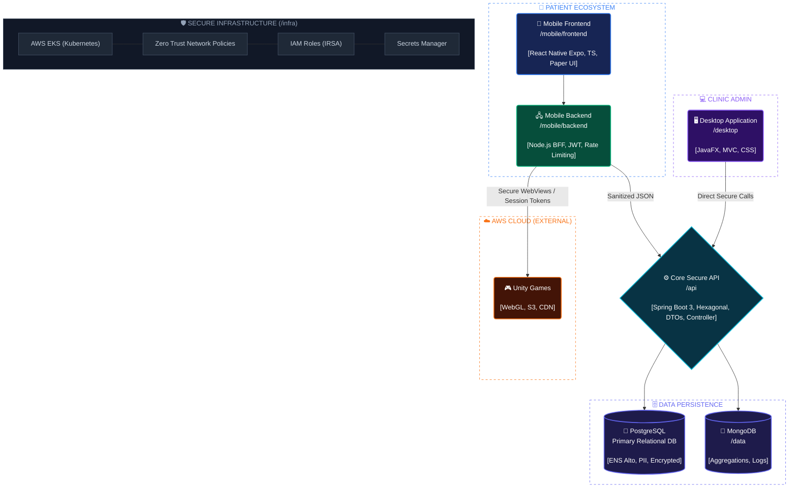

# RehabiAPP

**RehabiAPP** es un ecosistema clínico integral de nivel empresarial para rehabilitación médica, diseñado bajo los más estrictos estándares de seguridad (ENS Alto). La plataforma descentraliza la gestión sanitaria tradicional combinando un núcleo API robusto, microservicios de datos analíticos, un cliente de escritorio para la administración de la clínica y una aplicación móvil para pacientes que se conecta de forma segura a minijuegos terapéuticos alojados en la nube.

Este monorepo destaca no solo por su arquitectura de software, sino por su metodología de desarrollo: está construido y orquestado en su totalidad mediante un sistema de Inteligencia Artificial Multi-Agente denominado **Agents Team Lite**.

---

## Arquitectura del Sistema

El ecosistema aplica patrones de diseño avanzados orientados a la seguridad de confianza cero (Zero Trust), la separación de responsabilidades y la alta concurrencia.

### Diagrama de Arquitectura



### Mapa Tactico de Componentes

```
                              NUBE AWS (EXTERNA)
                            +--------------------------+
                            |       Unity Games        |
                            |    (WebGL / S3 / CDN)    |
                            +------------+-------------+
                                         ^
                                         | (WebViews Seguras / Tokens de Sesion)
                                         |
ECOSISTEMA DEL PACIENTE                  v
+-----------------------+      +-----------------------+         ADMINISTRACION DE CLINICA
|   /mobile/frontend    |      |    /mobile/backend    |         +-----------------------+
|  React Native (Expo)  |----->|  Node.js (Capa BFF)   |         |       /desktop        |
|  (TypeScript, Paper)  |      | (JWT, Rate Limiting)  |         |   JavaFX (MVC, CSS)   |
+-----------------------+      +-----------+-----------+         +-----------+-----------+
                                           |                                 |
                                           | (JSON Saneado)                  | (Llamadas Directas Seguras)
                                           v                                 v
CORE API SEGURO                +-----------------------------------------------+
                               |                     /api                       |
                               |           Spring Boot 4.0.5 (Java 24)          |
                               |   (Arquitectura Hexagonal, DTOs, Controller)   |
                               +------------+-----------------------+-----------+
                                            |                       |
                                            v                       v
CAPA DE DATOS                 +--------------------+      +--------------------+
                              |     PostgreSQL     |      |       /data        |
                              |   (ENS Alto, PII)  |      |      MongoDB       |
                              | (Campos Cifrados)  |      | (Agregaciones/Logs)|
                              +--------------------+      +--------------------+

===================================================================================================
INFRAESTRUCTURA SEGURA (/infra)
   AWS EKS (Kubernetes)  |  Politicas de Red Zero Trust  |  IAM Roles (IRSA)  |  Secrets Manager
===================================================================================================
```

---

## Stack Tecnologico

La pila tecnologica se ha definido exigiendo las versiones mas recientes y estables de la industria para garantizar soporte a largo plazo y maximo rendimiento.

### Core Backend (`/api`)

- **Runtime:** Java 24, Spring Boot 4.0.5
- **Driver de base de datos:** PostgreSQL 42.7.2 con Hibernate Envers para auditoria
- **Patron de arquitectura:** Arquitectura Hexagonal estricta

### Datos y Analitica (`/data`)

- **Base de datos:** MongoDB con Client-Side Field Level Encryption (CSFLE) para proteger Informacion de Identificacion Personal (PII)

### Ecosistema Movil (`/mobile`)

- **Frontend:** React Native (Expo), TypeScript estricto, React Native Paper (Material Design 3)
- **Backend (BFF):** Node.js, Express, Helmet, validacion estricta de JWT

### Gaming en la Nube (`/games`)

Los juegos terapeuticos en Unity (WebGL) residen de forma independiente en AWS. La app movil se vincula a ellos dinamicamente, garantizando que el tamano del repositorio no exceda los limites tecnicos de GitHub.

### Cliente de Escritorio (`/desktop`)

- **Framework:** JavaFX 23 con Java 24
- **Informes:** JasperReports 7.0.1
- **Concurrencia:** Implementacion multihilo mediante `Task<T>` y `Platform.runLater()` para evitar bloqueos en la interfaz

### Infraestructura (`/infra`)

- AWS EKS (Kubernetes)
- Politicas de red Zero Trust
- Integracion con AWS Secrets Manager mediante IRSA

---

## Metodologia de Desarrollo: Centuar Programing

Este proyecto utiliza un modelo de desarrollo innovador asistido por IA, dividiendo el monorepo mediante Git Worktrees para aislar los dominios. Esto permite el trabajo paralelo sin colisiones.

Metodología de desarrollo de software en la que el ingeniero conserva la autoridad total sobre las decisiones arquitectónicas, el diseño del sistema y la lógica crítica, 
delegando en la IA las tareas de menor carga cognitiva: generación de código repetitivo, refactoring rutinario y scaffolding de tests. 
El desarrollo se conduce principalmente mediante instrucciones en lenguaje natural (Speech-Driven Development), 
con la IA operando como ejecutor subordinado bajo supervisión continua del humano (Human-in-the-Loop). 
El humano define la intención y valida el resultado en cada punto de control relevante; la IA acelera la ejecución sin asumir el control estratégico.

### El Flujo Thinker / Doer

Cada directorio opera como un laboratorio independiente donde se orquesta a la IA mediante dos perfiles:

**Orquestador / Arquitecto (Opus):** Analiza el contexto, aplica las directrices de seguridad y redacta un plan arquitectonico (`PLAN.md`). No escribe codigo de implementacion.

**Implementador (Sonnet):** Lee el plan aprobado por el desarrollador humano y ejecuta el codigo, validando los resultados con herramientas de testing antes de finalizar.

### Gestion del Conocimiento (`.claude/skills`)

Para garantizar que la IA programa con nivel Senior, cada entorno cuenta con directrices de la industria inyectadas en carpetas ocultas. Las skills incluyen repositorios comunitarios verificados y reglas personalizadas que exigen:

- Cifrado a nivel de aplicacion en entidades JPA
- Prohibicion de consultas N+1 en bases de datos
- Uso exclusivo de TypeScript en entornos JavaScript
- Denegacion por defecto de todo el trafico interno en Kubernetes (Zero Trust)

---

## Cumplimiento y Seguridad (ENS Alto)

El sistema esta disenado desde cero para proteger la informacion sanitaria clinica.

**Sin secretos en el codigo:** Prohibicion estricta de subir credenciales al repositorio. Todo se gestiona mediante referencias a bovedas de secretos en la nube.

**Cifrado en reposo y en transito:** Toda comunicacion transcurre sobre TLS, y los campos sensibles de las bases de datos se cifran a nivel de aplicacion antes de tocar el disco.

**Auditoria total:** Cada modificacion de un registro clinico es trazada e identificada mediante listeners de persistencia, dejando un historial inmutable de accesos.

---

## Estructura del Repositorio

```
rehabiapp/
├── api/          # Core API Spring Boot 4 (Arquitectura Hexagonal)
├── data/         # Analitica MongoDB y configuracion CSFLE
├── mobile/
│   ├── frontend/ # Aplicacion React Native (Expo) para pacientes
│   └── backend/  # Capa BFF Node.js
├── desktop/      # Cliente de administracion de clinica JavaFX
├── infra/        # Manifiestos Kubernetes e infraestructura AWS
└── .claude/
    └── skills/   # Directrices y base de conocimiento para agentes IA
```

---

*Disenado, orquestado y desarrollado por @alaslibress con la ayuda de la IA no para sustituir al programador, si no para complementarlo*
