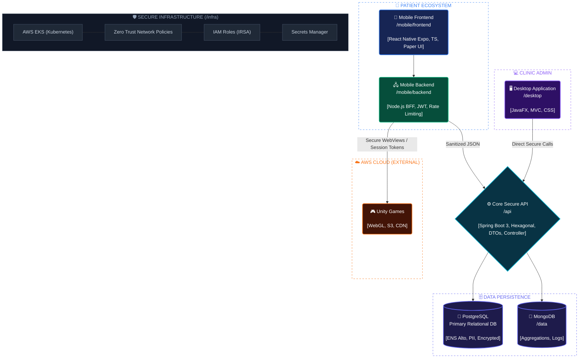

# RehabiAPP

<p align="center">
  
</p>

<p align="center">
  <b>Ecosistema clínico integral de rehabilitación médica · Diseñado bajo ENS Alto · Construido por un equipo multi-agente de IA</b>
</p>

## 🧰 Stack tecnológico

### Backend & API


### Desktop


### Mobile


### BFF & servicios Node


### Datos


### Games (externo)


### Chatbot IA


### Infraestructura & cloud


### Tooling & IA


---

**RehabiAPP** es un ecosistema clínico integral de nivel empresarial para rehabilitación médica, diseñado bajo los más estrictos estándares de seguridad (ENS Alto). La plataforma descentraliza la gestión sanitaria tradicional combinando un núcleo API robusto, microservicios de datos analíticos, un cliente de escritorio para la administración de la clínica y una aplicación móvil para pacientes que se conecta de forma segura a minijuegos terapéuticos alojados en la nube.

Este monorepo destaca no solo por su arquitectura de software, sino por su metodología de desarrollo: está construido y orquestado en su totalidad mediante un sistema de Inteligencia Artificial Multi-Agente denominado **Agents Team Lite**.

---

## Arquitectura del Sistema

El ecosistema aplica patrones de diseño avanzados orientados a la seguridad de confianza cero (Zero Trust), la separación de responsabilidades y la alta concurrencia.

### Diagrama de Arquitectura


```mermaid
flowchart TD
    %% Agrupaciones / Subgráficos
    
    subgraph Cloud ["☁️ AWS CLOUD (EXTERNAL)"]
        Unity("🎮 Unity Games<br/><br/>[WebGL, S3, CDN]")
    end

    subgraph Patient ["📱 PATIENT ECOSYSTEM"]
        MobileFE("📱 Mobile Frontend<br/>/mobile/frontend<br/><br/>[React Native Expo, TS, Paper UI]")
        MobileBE("🖧 Mobile Backend<br/>/mobile/backend<br/><br/>[Node.js BFF, JWT, Rate Limiting]")
    end

    subgraph Admin ["💻 CLINIC ADMIN"]
        Desktop("🖥️ Desktop Application<br/>/desktop<br/><br/>[JavaFX, MVC, CSS]")
    end

    CoreAPI{"⚙️ Core Secure API<br/>/api<br/><br/>[Spring Boot 3, Hexagonal, DTOs, Controller]"}

    subgraph Data ["🗄️ DATA PERSISTENCE"]
        PG[("🐘 PostgreSQL<br/>Primary Relational DB<br/><br/>[ENS Alto, PII, Encrypted]")]
        Mongo[("🍃 MongoDB<br/>/data<br/><br/>[Aggregations, Logs]")]
    end

    subgraph Infra ["🛡️ SECURE INFRASTRUCTURE (/infra)"]
        direction LR
        I1["AWS EKS (Kubernetes)"] --- I2["Zero Trust Network Policies"]
        I2 --- I3["IAM Roles (IRSA)"]
        I3 --- I4["Secrets Manager"]
    end

    %% Conexiones y Flujos
    
    MobileFE --> MobileBE
    MobileBE -- "Secure WebViews / Session Tokens" --> Unity
    
    MobileBE -- "Sanitized JSON" --> CoreAPI
    Desktop -- "Direct Secure Calls" --> CoreAPI
    
    CoreAPI --> PG
    CoreAPI --> Mongo

    %% Estilos de los Nodos (Alineados con la UI del código original)
    
    classDef aws fill:#431407,stroke:#f97316,stroke-width:2px,color:#fff;
    classDef frontend fill:#172554,stroke:#3b82f6,stroke-width:2px,color:#fff;
    classDef backend fill:#064e3b,stroke:#10b981,stroke-width:2px,color:#fff;
    classDef desktop fill:#2e1065,stroke:#8b5cf6,stroke-width:2px,color:#fff;
    classDef api fill:#083344,stroke:#06b6d4,stroke-width:2px,color:#fff;
    classDef db fill:#1e1b4b,stroke:#6366f1,stroke-width:2px,color:#fff;
    classDef infraNode fill:#1f2937,stroke:#475569,stroke-width:1px,color:#cbd5e1;

    class Unity aws;
    class MobileFE frontend;
    class MobileBE backend;
    class Desktop desktop;
    class CoreAPI api;
    class PG,Mongo db;
    class I1,I2,I3,I4 infraNode;
    
    %% Estilos de las cajas contenedoras
    style Cloud fill:none,stroke:#f97316,stroke-width:1px,stroke-dasharray: 5 5,color:#f97316
    style Patient fill:none,stroke:#3b82f6,stroke-width:1px,stroke-dasharray: 5 5,color:#3b82f6
    style Admin fill:none,stroke:#8b5cf6,stroke-width:1px,stroke-dasharray: 5 5,color:#8b5cf6
    style Data fill:none,stroke:#6366f1,stroke-width:1px,stroke-dasharray: 5 5,color:#6366f1
    style Infra fill:#111827,stroke:#334155,stroke-width:1px,color:#94a3b8
```

### Mapa Tactico de Componentes

```
                              NUBE AWS (EXTERNA)
                            +--------------------------+
                            |       Unity Games        |
                            |    (WebGL / S3 / CDN)    |
                            +------------+-------------+
                                         ^
                                         | (WebViews Seguras / Tokens de Sesion)
                                         |
ECOSISTEMA DEL PACIENTE                  v
+-----------------------+      +-----------------------+         ADMINISTRACION DE CLINICA
|   /mobile/frontend    |      |    /mobile/backend    |         +-----------------------+
|  React Native (Expo)  |----->|  Node.js (Capa BFF)   |         |       /desktop        |
|  (TypeScript, Paper)  |      | (JWT, Rate Limiting)  |         |   JavaFX (MVC, CSS)   |
+-----------------------+      +-----------+-----------+         +-----------+-----------+
                                           |                                 |
                                           | (JSON Saneado)                  | (Llamadas Directas Seguras)
                                           v                                 v
CORE API SEGURO                +-----------------------------------------------+
                               |                     /api                       |
                               |           Spring Boot 4.0.5 (Java 24)          |
                               |   (Arquitectura Hexagonal, DTOs, Controller)   |
                               +------------+-----------------------+-----------+
                                            |                       |
                                            v                       v
CAPA DE DATOS                 +--------------------+      +--------------------+
                              |     PostgreSQL     |      |       /data        |
                              |   (ENS Alto, PII)  |      |      MongoDB       |
                              | (Campos Cifrados)  |      | (Agregaciones/Logs)|
                              +--------------------+      +--------------------+

===================================================================================================
INFRAESTRUCTURA SEGURA (/infra)
   AWS EKS (Kubernetes)  |  Politicas de Red Zero Trust  |  IAM Roles (IRSA)  |  Secrets Manager
===================================================================================================
```

---

## Stack Tecnologico

La pila tecnologica se ha definido exigiendo las versiones mas recientes y estables de la industria para garantizar soporte a largo plazo y maximo rendimiento.

### Core Backend (`/api`)

- **Runtime:** Java 24, Spring Boot 4.0.5
- **Driver de base de datos:** PostgreSQL 42.7.2 con Hibernate Envers para auditoria
- **Patron de arquitectura:** Arquitectura Hexagonal estricta

### Datos y Analitica (`/data`)

- **Base de datos:** MongoDB con Client-Side Field Level Encryption (CSFLE) para proteger Informacion de Identificacion Personal (PII)

### Ecosistema Movil (`/mobile`)

- **Frontend:** React Native (Expo), TypeScript estricto, React Native Paper (Material Design 3)
- **Backend (BFF):** Node.js, Express, Helmet, validacion estricta de JWT

### Gaming en la Nube (`/games`)

Los juegos terapeuticos en Unity (WebGL) residen de forma independiente en AWS. La app movil se vincula a ellos dinamicamente, garantizando que el tamano del repositorio no exceda los limites tecnicos de GitHub.

### Cliente de Escritorio (`/desktop`)

- **Framework:** JavaFX 23 con Java 24
- **Informes:** JasperReports 7.0.1
- **Concurrencia:** Implementacion multihilo mediante `Task<T>` y `Platform.runLater()` para evitar bloqueos en la interfaz

### Infraestructura (`/infra`)

- AWS EKS (Kubernetes)
- Politicas de red Zero Trust
- Integracion con AWS Secrets Manager mediante IRSA

---

## Metodologia de Desarrollo: Centuar Programing

Este proyecto utiliza un modelo de desarrollo innovador asistido por IA, dividiendo el monorepo mediante Git Worktrees para aislar los dominios. Esto permite el trabajo paralelo sin colisiones.

Metodología de desarrollo de software en la que el ingeniero conserva la autoridad total sobre las decisiones arquitectónicas, el diseño del sistema y la lógica crítica, 
delegando en la IA las tareas de menor carga cognitiva: generación de código repetitivo, refactoring rutinario y scaffolding de tests. 
El desarrollo se conduce principalmente mediante instrucciones en lenguaje natural (Speech-Driven Development), 
con la IA operando como ejecutor subordinado bajo supervisión continua del humano (Human-in-the-Loop). 
El humano define la intención y valida el resultado en cada punto de control relevante; la IA acelera la ejecución sin asumir el control estratégico.

### El Flujo Thinker / Doer

Cada directorio opera como un laboratorio independiente donde se orquesta a la IA mediante dos perfiles:

**Orquestador / Arquitecto (Opus):** Analiza el contexto, aplica las directrices de seguridad y redacta un plan arquitectonico (`PLAN.md`). No escribe codigo de implementacion.

**Implementador (Sonnet):** Lee el plan aprobado por el desarrollador humano y ejecuta el codigo, validando los resultados con herramientas de testing antes de finalizar.

### Gestion del Conocimiento (`.claude/skills`)

Para garantizar que la IA programa con nivel Senior, cada entorno cuenta con directrices de la industria inyectadas en carpetas ocultas. Las skills incluyen repositorios comunitarios verificados y reglas personalizadas que exigen:

- Cifrado a nivel de aplicacion en entidades JPA
- Prohibicion de consultas N+1 en bases de datos
- Uso exclusivo de TypeScript en entornos JavaScript
- Denegacion por defecto de todo el trafico interno en Kubernetes (Zero Trust)

---

## Cumplimiento y Seguridad (ENS Alto)

El sistema esta disenado desde cero para proteger la informacion sanitaria clinica.

**Sin secretos en el codigo:** Prohibicion estricta de subir credenciales al repositorio. Todo se gestiona mediante referencias a bovedas de secretos en la nube.

**Cifrado en reposo y en transito:** Toda comunicacion transcurre sobre TLS, y los campos sensibles de las bases de datos se cifran a nivel de aplicacion antes de tocar el disco.

**Auditoria total:** Cada modificacion de un registro clinico es trazada e identificada mediante listeners de persistencia, dejando un historial inmutable de accesos.

---

## Estructura del Repositorio

```
rehabiapp/
├── api/          # Core API Spring Boot 4 (Arquitectura Hexagonal)
├── data/         # Analitica MongoDB y configuracion CSFLE
├── mobile/
│   ├── frontend/ # Aplicacion React Native (Expo) para pacientes
│   └── backend/  # Capa BFF Node.js
├── desktop/      # Cliente de administracion de clinica JavaFX
├── infra/        # Manifiestos Kubernetes e infraestructura AWS
├── chatbot/      # Bot WhatsApp + Qwen 2.5 para agendar citas
└── .claude/
    └── skills/   # Directrices y base de conocimiento para agentes IA
```

---

## 🔄 Flujos de trabajo principales

### 1. Login + onboarding paciente (mobile)
```
Paciente abre app → Login pantalla
   │
   ├── POST GraphQL `login(identifier, password)` → BFF
   │       └─► POST /api/auth/login-paciente → API → BCrypt verify (RDS)
   │       ◄── JWT Java 15min + refresh 14d
   │
   ◄── JWT BFF emitido al móvil (firmado por BFF)
        │
        └─► Bootstrap: fetchProfile + disabilities + treatments + games
                + body parts progress + appointments + push token
```

### 2. Sesión de juego terapéutico (Unity WebGL)
```
Paciente tap "Jugar" en PIANO
   │
   ├── Mutation GraphQL `startGame(idVideojuego)` → BFF
   │       └─► token efímero JWT 5min scope GAMES_PLAY
   │
   ├── Linking.openURL(<S3>/?api=...&dni=...&token=<eph>)
   │       └─► Navegador externo abre Unity WebGL
   │
   ├── Paciente completa sesión → POST /api/telemetria/sesion-juego
   │       └─► API valida JWT + enriquece disability/treatment
   │            └─► /data /ingest/game-session
   │                  └─► Mongo `game_sessions` (rawMetrics, hash, MD generado)
   │
   ◄── Vuelve a la app → Dashboard refresca métricas
```

### 3. Generación informe PDF clínico (desktop)
```
Sanitario en JavaFX → click "Generar PDF" sobre paciente
   │
   ├── ApiClient GET /api/pacientes/{dni} + citas asociadas
   ├── JRBeanCollectionDataSource(lista) + JasperFillManager.fillReport
   ├── exportReportToPdfFile → desktop/informes/<timestamp>.pdf
   └── Desktop.open(pdf)  ← thread daemon (no bloquea JavaFX)
```

### 4. Agenda de cita vía WhatsApp (chatbot)
```
Paciente WhatsApp → "Quiero cita mañana 10:00"
   │
   ├── whatsapp-web.js recibe mensaje
   ├── llm.extraerIntencion → Ollama Qwen 2.5 (JSON mode, temp 0.2)
   │       ◄── {intent: book_appointment, fecha: 2026-05-19, hora: 10:00}
   ├── booking.manejarMensaje
   │       └─► pg pool → RDS `cita` INSERT (con FK paciente/sanitario)
   ◄── msg.reply confirmación con detalles
```

### 5. Despliegue AWS Academy (1 EC2 docker)
```
Desarrollador → git push (local)
   │
   ├── rsync code → EC2 (44.213.141.127)
   ├── docker build api/data/bff/chatbot
   └── docker compose up -d
            ├── caddy (TLS LetsEncrypt + DuckDNS)
            ├── api Spring Boot ─► RDS PostgreSQL
            ├── data Spring Boot ─► Mongo container
            ├── bff Node Express ─► api interno
            └── chatbot Node Puppeteer ─► tunnel SSH inverso al Ollama del dev
```

---

## 📂 Apartados por directorio

### `/api` — Core REST API
**Stack**: Spring Boot 4.0.5 · Java 24 · Hibernate 7 + Envers · Flyway · jjwt · MapStruct · Bucket4j (rate limit) · Springdoc OpenAPI

**Función**: Hub central. Expone todos los endpoints REST consumidos por desktop, BFF mobile y juegos Unity. Gestiona JWT (sanitarios + pacientes), RBAC (SPECIALIST/NURSE/PATIENT), auditoría inmutable `audit_log`, cifrado AES-256-GCM de campos clínicos, y rutea telemetría de juegos al pipeline `/data`.

**Comandos**:
```bash
cd api
./mvnw test                                # Suite JUnit + IT (42/42 verde)
./scripts/api-dev.sh                       # Run con auto-stop de instancia previa
./mvnw flyway:migrate                      # Aplicar migraciones SQL (V1..V21)
```

**Endpoints destacados**: `/api/auth/login`, `/api/auth/login-paciente`, `/api/pacientes`, `/api/citas`, `/api/telemetria/sesion-juego`, `/api/catalogo/{discapacidades,tratamientos}`, `/api/pacientes/{dni}/progreso/{check,markdown,resumen}`, `/swagger-ui.html`.

---

### `/data` — Pipeline analítico
**Stack**: Spring Boot 4 · Java 24 · Spring Data MongoDB · Micrometer Prometheus · Markdown generator

**Función**: Servicio **interno** que ingesta telemetría de juegos, persiste en Mongo (`game_sessions`, `treatment_progress`, `patient_markdown`), agrega progreso por parte del cuerpo + tratamiento, y genera reportes Markdown anonimizados con `patientToken` (SHA-256). Programa refrescos nocturnos (`@Scheduled`).

**Endpoints internos** (`X-Internal-Key`):
- `POST /ingest/game-session` (validación schema PIANO/ROM)
- `GET /analytics/patient/{dni}/treatment-progress`
- `GET /analytics/patient/{dni}/markdown` (`text/markdown`)
- `GET /internal/patient/{dni}/summary`
- `GET /internal/patient/{dni}/check-new-data?since=<Instant>`

---

### `/desktop` — Cliente JavaFX (SGE)
**Stack**: Java 24 · JavaFX 23 (FXML + CSS) · Ikonli Material Design 2 · ControlsFX · CalendarFX · JasperReports · PDFBox · Gradle

**Función**: ERP del sanitario. CRUD completo de pacientes, sanitarios, citas (calendario), discapacidades, tratamientos y videojuegos. Vincula tratamientos↔discapacidades↔juegos por niveles de progresión. Genera PDFs por paciente y listados de sanitarios. Visualiza progreso terapéutico con polling `/api/pacientes/{dni}/progreso/check`.

**Migración 2026**: eliminada conexión JDBC directa — ahora consume **REST API** vía `ApiClient` (config: `api.properties` o env `REHABIAPP_API_URL`).

**Comandos**:
```bash
cd desktop
./gradlew clean run                        # Arrancar app
./gradlew test                             # JUnit5 + Mockito
```

**Credenciales test**: DNI `87654321B` / Pwd `especialista` (sanitario seed V14+V19).

---

### `/mobile/frontend` — App paciente (React Native)
**Stack**: Expo SDK 54 · TypeScript 5.9 · Expo Router (file-based) · Apollo Client · Zustand (+ persist middleware) · NativeWind 4 · expo-secure-store · expo-notifications · phosphor-react-native

**Función**: App accesible (touch ≥48dp, contraste WCAG AA) que muestra al paciente su perfil clínico, discapacidades con nivel, tratamientos con PDFs descargables, juegos desbloqueados, progreso por zona del cuerpo (BodyDiagram SVG), historial de citas y push notifications de recordatorios.

**Comandos**:
```bash
cd mobile/frontend
npx expo start                             # Servidor dev
npx expo start --android | --ios           # Build emulador
```

**Credenciales test**: DNI `11111111H` / Pwd `Juan1234!` (paciente seed V18).

---

### `/mobile/backend` — BFF GraphQL
**Stack**: Node.js 20 · Express 5 · Apollo Server 4 · jsonwebtoken · fetch nativo · Pino · prom-client

**Función**: Backend-For-Frontend GraphQL. Gateway de seguridad entre app móvil e API Java. Emite JWT BFF propio (HMAC-SHA256), cachea token Java internamente, formatea errores en español, inyecta saludo según timezone, modera scope GAMES_PLAY para juegos.

**Operaciones GraphQL**: `login`, `refreshToken`, `me`, `myDisabilities`, `myProgress`, `myTreatments`, `myAppointments`, `bookAppointment`, `cancelAppointment`, `myGameSessions`, `availableGames`, `startGame`, `myBodyPartProgress`, `bodyPartMetrics`.

**Comandos**:
```bash
cd mobile/backend
npm start                                  # Production
npm run start:aws                          # Con .env apuntando AWS
npm run dev                                # Watch + mock API
npm test                                   # 26 tests Apollo
```

---

### `/chatbot` — Asistente WhatsApp con IA local
**Stack**: Node.js 20 · whatsapp-web.js (Puppeteer + Chromium) · Ollama SDK · pg (PostgreSQL) · Express · Pino

**LLM**: **Qwen 2.5** (Coder 7B o Instruct) servido vía **Ollama** local. Modo JSON, temperatura 0.2 → extracción determinista de intent + fecha/hora.

**Función**: Bot WhatsApp para que pacientes soliciten/cancelen citas conversacionalmente. Flow:
1. WhatsApp Web pairing (QR scan inicial)
2. Mensaje recibido → `llm.extraerIntencion` → `{intent, fecha, hora, respuesta_usuario}`
3. Si `intent=book_appointment` → `booking.manejarMensaje` valida reglas clínicas (slot 30min, 09:00-18:00, L-V, lead 2h) → `pg` INSERT en `cita`
4. Respuesta conversacional al paciente

**Reglas de despliegue**:
- Container Docker `bullseye-slim` con Chromium del SO (Puppeteer)
- Conexión Ollama vía **tunnel SSH inverso** desde laptop del dev (`-R 0.0.0.0:11434:localhost:11434`) o instancia Ollama dedicada
- Volumen `chatbot-wweb-session` persiste sesión WhatsApp Web (no requiere re-scan QR)
- ⚠️ `whatsapp-web.js` es cliente no oficial → bot detection ocasional; producción real recomendado **WhatsApp Business Cloud API** (Meta)

**Comandos**:
```bash
cd chatbot
npm start                                  # Arranque (lee .env)
docker logs -f rehabiapp-chatbot           # Ver QR para scan inicial
```

---

### `/infra` — Kubernetes & AWS
**Stack**: Docker · Docker Compose · Kubernetes (EKS-ready) · Kustomize · Caddy · Terraform · ECR

**Estructura**:
```
infra/
├── docker/                  # Dockerfiles base (api, data, mobile-backend)
├── k8s/
│   ├── base/                # Manifiestos comunes (Deployment, Service, ConfigMap, HPA, PDB, NetworkPolicy)
│   │   ├── api/
│   │   ├── data/
│   │   ├── mobile-backend/
│   │   ├── postgresql/      # Solo dev local
│   │   └── mongodb/         # Solo dev local
│   ├── overlays/
│   │   ├── local/           # Para dev (Minikube/Kind) — DBs in-cluster
│   │   └── aws/             # Para EKS prod — RDS+DocumentDB externos, IRSA, CSI Secrets Manager, ALB Ingress
└── aws-academy/             # Stack EC2-Docker para AWS Academy Learner Lab
    ├── docker-compose.aws.yml  # 6 contenedores en red bridge `rehabiapp-aws`
    ├── Caddyfile               # Reverse proxy TLS + DuckDNS
    └── scripts/                # Helpers de deploy + backup
```

**Modelo de seguridad (overlay aws)**:
- **Zero Trust NetworkPolicy** — default-deny + permisos explícitos por servicio (api↔data, bff↔api).
- **IAM Roles for Service Accounts (IRSA)** — cada Deployment tiene su ServiceAccount con rol AWS específico (RDS, Secrets, S3).
- **CSI Secrets Store** — secretos montados como volúmenes `/mnt/secrets`, NO env vars.
- **PDB** — `minAvailable: 1` por servicio para que rolling updates no quiebren disponibilidad.
- **HPA** — escalado horizontal por CPU 70% / memoria 80%.

**Deploy AWS Academy (1 EC2, sin EKS)**:
```bash
cd /home/ec2-user/rehabiapp
docker compose --env-file infra/aws-academy/.env.aws-academy \
  -f infra/aws-academy/docker-compose.aws.yml up -d --build
```

**Deploy producción EKS**:
```bash
kubectl apply -k infra/k8s/overlays/aws
```

---

## 🔐 Cumplimiento legal

| Norma | Cobertura |
|-------|-----------|
| **RGPD Art. 9** | Cifrado AES-256-GCM en campos clínicos especiales |
| **RGPD Art. 17** | Soft delete + retención 5 años (Ley 41/2002) |
| **RGPD Art. 30** | `audit_log` inmutable con READ + CRUD de pacientes |
| **RGPD Art. 32** | BCrypt cost-12, JWT, RBAC, SSL/TLS en transit |
| **LOPDGDD** | Datos clínicos como categoría especial |
| **ENS Alto** | Zero Trust + trazabilidad + IRSA + Secrets Manager |
| **e-prescripción** | Planificado: FNMT + AEMPS + CIE-10 |

---

*Disenado, orquestado y desarrollado por @alaslibress con la ayuda de la IA no para sustituir al programador, si no para complementarlo*
